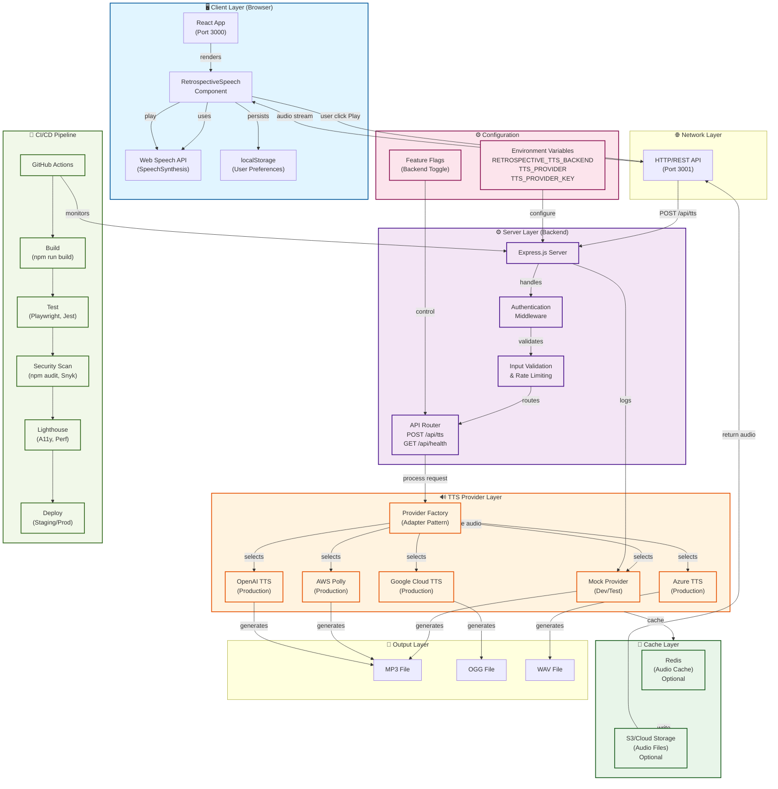

# System Architecture

## High-Level Architecture Diagram



## Component Details

### Client Layer (Browser)
- **React App** (Port 3000): Main React application entry point
- **RetrospectiveSpeech Component**: Core TTS UI component with controls
- **Web Speech API**: Browser-native text-to-speech via `SpeechSynthesis`
- **localStorage**: Persists user preferences (voice, speed, pitch)

**Flow**: User interacts with component → calls Web Speech API → audio playback

### Network Layer
- **HTTP/REST API** (Port 3001): Express server communication
- Handles async requests from client to backend
- Returns binary audio stream or JSON responses

### Server Layer (Backend)
- **Express.js Server**: Main application server
- **Authentication Middleware**: Validates `Authorization` header
- **Input Validation & Rate Limiting**: 
  - Validates text length (max 10,000 chars)
  - Validates audio format (MP3, OGG, WAV)
  - Enforces rate limit (30 req/min per IP)
- **API Router**: 
  - `POST /api/tts` — Generate audio from text
  - `GET /api/health` — Health check endpoint

### TTS Provider Layer
Uses **Adapter Pattern** for pluggable providers:

| Provider | Status | Use Case | Quality | Cost |
|----------|--------|----------|---------|------|
| Mock | ✅ Working | Development, testing | Low (silent) | $0 |
| AWS Polly | 🏗️ Stub | Production | High | $0.000004/char |
| Google Cloud | 🏗️ Stub | Production | High | $0.000004/char |
| Azure | 🏗️ Stub | Production | High | $0.000004/char |
| OpenAI | 🏗️ Stub | Production | High | $0.000015/char |

**Provider Selection** via `TTS_PROVIDER` env var:
```javascript
const provider = process.env.TTS_PROVIDER || 'mock';
switch (provider) {
  case 'aws': return require('./providers/awsTtsProvider');
  case 'gcp': return require('./providers/gcpTtsProvider');
  // ...
}
```

### Cache Layer (Optional)
- **Redis**: In-memory cache for generated audio
  - Reduces provider API calls
  - Key: `hash(text, voice, rate, format)`
  - TTL: Configurable (default 7 days)
- **S3/Cloud Storage**: Long-term audio file storage
  - Archive retrospectives
  - CDN delivery for downloads

### Configuration
- **Environment Variables**:
  - `RETROSPECTIVE_TTS_BACKEND` — Feature flag (true/false)
  - `TTS_PROVIDER` — Provider selection (mock, aws, gcp, azure, openai)
  - `TTS_PROVIDER_KEY` — API key (only if using real provider)
- **Feature Flags**: Kill switches for gradual rollout

### CI/CD Pipeline
**GitHub Actions Workflows**:
1. **Build**: React production build (`npm run build`)
2. **Test**: Jest + Playwright on 5 browsers/devices
3. **Security**: npm audit + Snyk scanning
4. **Lighthouse**: Performance (70+), Accessibility (90+), SEO (80+)
5. **Deploy**: Auto-deploy to staging (develop) or production (main)

## Data Flow Diagrams

### Play Audio Flow
```
User clicks "Play"
    ↓
RetrospectiveSpeech.handlePlay()
    ↓
SpeechSynthesisUtterance(text)
    ↓
speechSynthesis.speak(utterance)
    ↓
Browser Web Speech API
    ↓
Audio playback via system speaker
    ↓
onend / onerror callbacks
    ↓
Update UI status
```

### Download Audio Flow (Server Fallback)
```
User clicks "Download"
    ↓
handleDownload()
    ↓
POST /api/tts with { text, voice, format, rate }
    ↓
Express server receives request
    ↓
Auth middleware validates Authorization header
    ↓
Validation middleware checks input
    ↓
Router selects TTS provider
    ↓
Provider.renderTTS(options)
    ↓
Provider API (AWS/GCP/Azure/OpenAI)
    ↓
Binary audio stream returned
    ↓
Content-Disposition: attachment header
    ↓
Browser downloads file
```

## Deployment Architecture

### Development
```
localhost:3000  ← React dev server
localhost:3001  ← Express backend
Browser Web Speech API
Mock TTS provider
```

### Staging
```
staging.example.com          ← React build (Vercel/S3)
api-staging.example.com      ← Express (Heroku/Cloud Run)
Redis (Upstash/ElastiCache)  ← Cache
AWS Polly (or other TTS)     ← Audio generation
```

### Production
```
example.com                  ← React build (CloudFront/Vercel)
api.example.com              ← Express (ECS/Cloud Run/Lambda)
Redis (AWS ElastiCache)      ← Cache
RDS PostgreSQL               ← Usage tracking DB
S3 + CloudFront              ← Audio CDN delivery
AWS Polly                    ← Audio generation
```

## Technology Stack

| Layer | Technology | Purpose |
|-------|-----------|---------|
| **Frontend** | React 18 | UI framework |
| | Web Speech API | Client-side TTS |
| | localStorage | User preferences |
| | CSS3 | Styling & responsive |
| **Backend** | Node.js 16+ | Runtime |
| | Express.js | Web framework |
| | dotenv | Config management |
| **TTS** | AWS Polly | Production audio |
| | Google Cloud TTS | Alternative provider |
| | Azure Speech | Alternative provider |
| | OpenAI TTS | Alternative provider |
| **Cache** | Redis | Audio cache (optional) |
| **Storage** | S3 | File storage (optional) |
| **Testing** | Playwright | E2E testing |
| | Jest | Unit testing |
| | Cucumber | BDD scenarios |
| **CI/CD** | GitHub Actions | Automation |
| | Codecov | Coverage tracking |
| | Snyk | Security scanning |

## Security Architecture

### Authentication
- Stub middleware in development
- Real JWT/OAuth2 in production
- API key validation per request

### Rate Limiting
- 30 requests/minute per IP
- Token bucket algorithm
- Configurable per deployment

### Data Protection
- No logging of raw note text (PII)
- HTTPS only in production
- Environment variables for secrets
- GitHub Actions secrets for CI/CD

### Privacy
- **Default**: Web Speech API (no external calls)
- **Optional**: Server TTS requires explicit opt-in
- No data stored long-term (except audio cache)
- User consent for provider data sharing

## Scalability Considerations

### Horizontal Scaling
- Stateless Express servers (scale with load balancer)
- Redis for shared cache layer
- CDN for static assets and audio files

### Vertical Scaling
- Increase server memory for large audio files
- Provider rate limits may require caching

### Cost Optimization
- Cache frequently requested audio
- Use mock provider for dev/test
- Monitor TTS provider costs

### Performance
- Browser TTS: < 2 seconds
- Server TTS: < 5 seconds (includes network)
- Audio download: < 1 second (cached)

## Monitoring & Observability

### Metrics to Track
- TTS latency (server-side)
- Provider API usage & cost
- Cache hit rate
- Error rate & types
- User engagement (listening time)

### Logging
- Request/response logs
- Provider API calls
- Authentication failures
- Rate limit hits

### Alerting
- High error rate (> 5%)
- Provider API failures
- Rate limit exhaustion
- Cost spike alerts

---

**Architecture Version**: 1.0.0  
**Last Updated**: April 1, 2026  
**Maintainer**: Devpost AI Team
